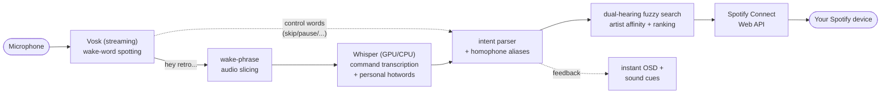

<p align="center"></p>

<p align="center">
  <a href="https://github.com/haeganm/retro/actions/workflows/ci.yml"></a>
  
  
  
  
</p>

# Retro

A free, local voice remote **for Spotify Premium**. Runs in your system tray,
listens offline (speech never leaves your machine), and controls whatever
device Spotify is already playing on — desktop, phone, speaker.

> **"hey retro, play bohemian rhapsody"**

<!-- demo GIF goes here: docs/demo.gif -->

## Why it's different

- **It knows *your* music.** Your top artists, playlists, and liked songs are
  injected into the recognizer's vocabulary and boosted in search ranking — so
  niche artist names and personal playlist names ("7.0", spoken as
  "seven point o") resolve correctly when generic assistants fail.
- **It forgives how people actually talk.** Two speech engines hear every
  command and their transcriptions *compete* in a fuzzy-ranked search — a
  garbled "play money to work by eat" still finds *Money Twërk by Yeat*.
  Control words ("skip", "pause") dispatch instantly with zero transcription
  latency.
- **Zero cloud, zero cost, zero secrets.** There is no server and no account:
  Spotify Connect is the player, auth is PKCE against your own free developer
  app, speech is processed entirely on-device (GPU-accelerated Whisper when
  you have an NVIDIA card), and your session token is encrypted at rest.

## Architecture



Everything left of the Spotify API runs offline on your machine.

## Requirements

- Windows 10/11 (this app is Windows-only)
- Spotify **Premium** (the playback-control API requires it)
- Python 3.10–3.12 (`winget install Python.Python.3.12` if you don't have it)
- A microphone
- Spotify open on at least one device (the API commands a device; it doesn't produce audio)
- An NVIDIA GPU is optional — the installer detects one and enables faster,
  more accurate recognition automatically

## Install (one command, $0)

```powershell
git clone https://github.com/YOURNAME/retro
cd retro
powershell -ExecutionPolicy Bypass -File install.ps1
```

The installer creates an isolated environment, installs the tested dependency
set (`requirements.lock`), enables GPU acceleration if you have an NVIDIA
card, and puts a **Retro** icon on your desktop.

Then the one-time human part (5 minutes):

1. Create a free app at <https://developer.spotify.com/dashboard>
   - Redirect URI (exactly): `http://127.0.0.1:8888/callback`
   - API: Web API
2. Double-click the desktop icon, paste your app's **Client ID** into the
   dialog, and approve the browser sign-in once (PKCE — no client secret
   involved). The speech models (~120 MB) download on first run.

After that it just runs. Tray menu → **Start with Windows** makes it launch
silently at login.

<details><summary>Developer install (no installer)</summary>

```sh
pip install .        # or pip install -e . for hacking
retro                # console entry point
```
</details>

## Commands

Say the wake phrase (**"hey retro"** by default — a short beep confirms it heard
you), then:

| Say | Does |
|---|---|
| `play <song>` / `play <song> by <artist>` | search and play a track |
| `queue <song>` / `play <song> next` / `add <song> to the queue` | add to queue |
| `play the artist <name>` / `play songs by <name>` | play an artist |
| `play the album <name>` / `play my playlist <name>` | album / your playlists |
| `play my liked songs` | shuffle your liked songs |
| `pause` / `stop` | pause |
| `play` / `resume` | resume |
| `next` / `skip` | next track |
| `previous` / `go back` | previous track |
| `volume up` / `turn it up` / `set volume to fifty` | Spotify volume (never system volume) |
| `what's playing` | show current track |
| `shuffle on` / `shuffle off` | shuffle |
| `put it back` / `go back to what was playing` | undo - restore what was on before |

Say it in one breath ("hey retro play thriller") or wait for the beep /
*Listening...* notification after the wake phrase.

Test without a mic: `retro --say "play daft punk"` ·
Debug what it hears: `retro --debug`, or check the transcript log at
`%APPDATA%\Retro\retro.log` (every recognition + command outcome) ·
List everything it failed to understand: `retro --misses`.

Control commands (skip/pause/volume/...) dispatch instantly from the wake-word
engine; only title-carrying commands (play/queue/...) take the ~0.6s Whisper pass.

## Config

`%APPDATA%\Retro\config.json`:

```json
{
  "client_id": "...",
  "wake_phrase": "hey retro",
  "model": "small",
  "input_device": null,
  "sound": true,
  "stt": "whisper",
  "whisper_model": "base.en"
}
```

- `model`: the Vosk wake-word model - `"small"` (default) or `"medium"`
- `stt`: `"whisper"` (default) or `"vosk"` to skip Whisper on very weak machines
- `whisper_model`: `"auto"` (default: small.en on GPU, base.en on CPU) or any
  faster-whisper model name
- `device`: `"auto"` (default: NVIDIA GPU when present - install
  `nvidia-cublas-cu12 nvidia-cudnn-cu12` - else CPU), `"cuda"`, or `"cpu"`
- `input_device`: pick a microphone from the tray menu instead of editing this
- `sound`: wake chime + success/error cues; `false` to disable
- `duck`: `true` (default) - music volume dips while you speak a command,
  restored right after (big win for speaker setups)
- `notify`: `"smart"` (default - subtle sound for control commands, voice/toast
  for results and errors; the tray tooltip always shows the last action) or
  `"all"` to toast everything
- `log`: `true` (default) - keep the local speech transcript log for
  debugging; `false` disables it

## Tray menu

Listening on/off · Microphone picker · Start with Windows · Re-authenticate · Quit

## Tests

```sh
python test_intents.py   # parser + player logic (offline, instant)
python e2e_voice.py      # synthesized speech through the real model (Windows)
```

## Privacy & security

- **Speech never leaves your machine** - wake-word and transcription are fully
  offline. Outbound traffic is exactly: `api.spotify.com`/`accounts.spotify.com`
  (HTTPS, playback + auth) and two one-time model downloads
  (`alphacephei.com`, SHA-256-verified; `huggingface.co`, hash-verified). No
  telemetry, no update checks.
- **Auth is OAuth PKCE** - no client secret exists anywhere. Your Spotify
  token is encrypted at rest with Windows DPAPI; your Client ID is not a
  secret. Everything lives in `%APPDATA%\Retro`, never in the repo.
- **Transcript log**: recognized speech is kept locally in `retro.log` (last
  ~500 lines) for debugging. Set `"log": false` in config to disable, or
  delete the file anytime.
- **System-touching behaviors** (both user-triggered, both reversible):
  "Start with Windows" creates a Startup shortcut; selecting a Bluetooth
  headset mic temporarily switches the Windows default audio output so your
  music keeps playing, restored when you switch back - crash-safe.

See [SECURITY.md](SECURITY.md) for the full threat model.

## Troubleshooting

| Symptom | Do this |
|---|---|
| It never hears the wake word | `retro --mic-test` — speak while it runs; pick the mic with the biggest bar (tray → Microphone), or leave it on Automatic |
| It mishears commands | `retro --misses` lists everything it failed to parse; `%APPDATA%\Retro\retro.log` shows exactly what each engine heard |
| "No Spotify device found" | Open Spotify on any device — this is a remote, not a player |
| Music goes quiet/mono on a Bluetooth headset mic | Windows can't do hi-fi audio + headset mic at once; the app keeps sound flowing on the headset channel and restores hi-fi when you switch mics. Use Automatic (a wired/built-in mic) for full quality |
| Commands need Premium | The Spotify playback API rejects free accounts |

Uninstall: delete the repo folder, `%APPDATA%\Retro`, and the desktop
shortcut (plus tray → "Start with Windows" off, or delete the Startup shortcut).

## License & credits

**GPL-3.0** — see [LICENSE](LICENSE). Use it, learn from it, fork it — but
derivatives must stay open source with attribution. Copyright (C) 2026
Haegan McGarry.

Built on [Vosk](https://alphacephei.com/vosk/) (Apache-2.0),
[faster-whisper](https://github.com/SYSTRAN/faster-whisper) / OpenAI Whisper
(MIT), and [spotipy](https://github.com/spotipy-dev/spotipy) (MIT).

---

*Retro is an independent project — not affiliated with, endorsed by, or
sponsored by Spotify AB. Spotify is a trademark of Spotify AB. Requires a
user-created Spotify developer application and a Spotify Premium account.*
